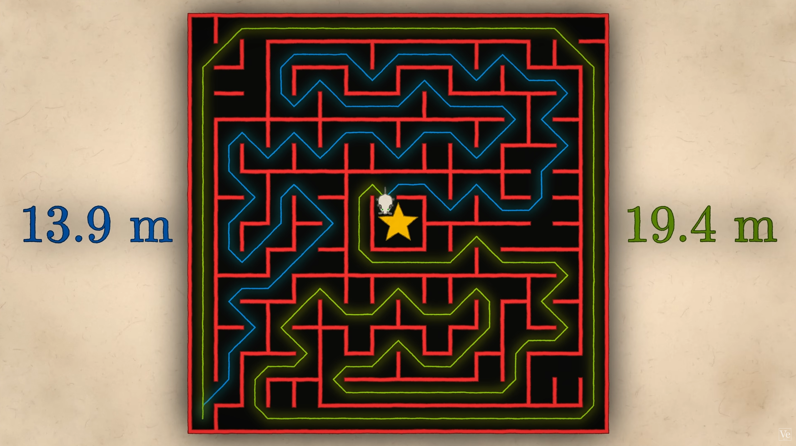
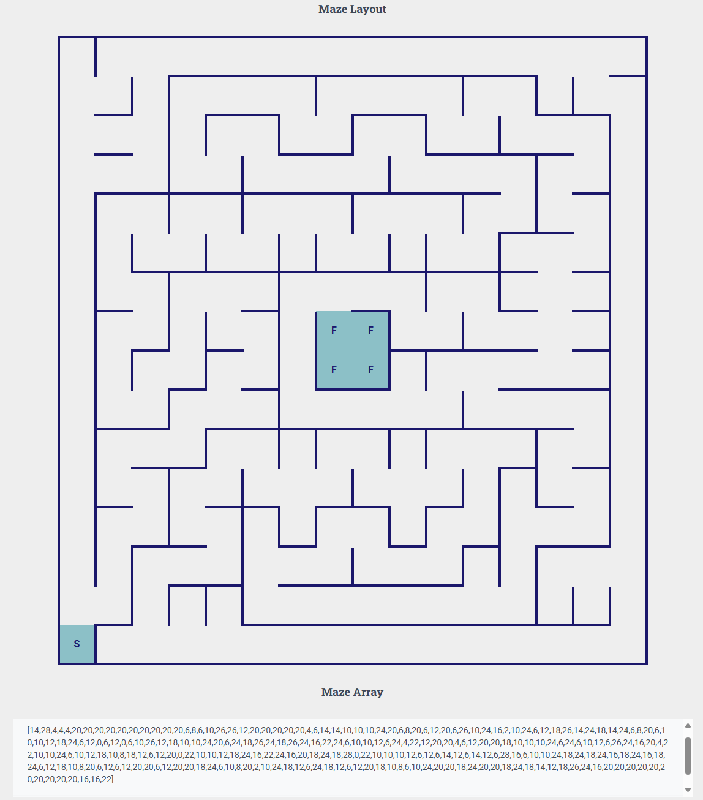
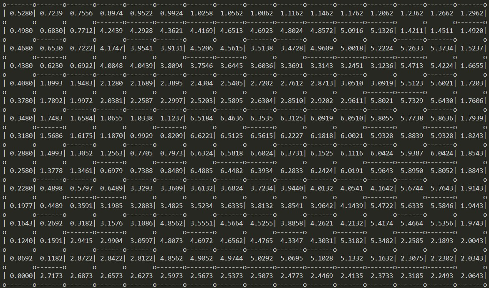

# MicroMouse-FloodFill-Simulator
En este código hemos implementado el algoritmo de FloodFill para nuestro robot de MicroMouse bajo la premisa de _encontrar el camino más rápido_ en lugar de _el camino más corto_ como hacíamos anteriormente.


Aquí podemos ver un ejemplo sacado del vídeo de Veritasium
[The Fastest Maze-Solving Competition On Earth](https://www.youtube.com/watch?v=ZMQbHMgK2rw&t=600s&ab_channel=Veritasium ).

Donde se ve un camino verde de 19.4m frente a un camino azul más corto de 13.9m. Sin embargo el camino verde tiene rectas más largas y tan solo 45 giros, mientras que el camino azul tiene 57 giros.

Para implementar este nuevo algoritmo nos hemos basado en el vídeo [ArduBot Pro 2023 workshop EP4 - maze solver (Chinese version, 洪水迷宮演算法)](https://www.youtube.com/watch?v=jIdBi7FrioE ) en el que explica como implementar el FloodFill mediante pesos calculados en función del tiempo teórico que el robot tardaría en llegar a la meta.

Para ello, lo principal es calcular cuánto tarda el robot en atravesar una casilla en función de su velocidad base, su aceleración, y su velocidad máxima, asignándole una penalización por giro calculada según lo que tarde en frenar a la velocidad necesaria para realizar el giro. Por supuesto, esto mismo también aplica para los movimientos en diagonales.

Teniendo todo esto en cuenta hemos generado este codigo al cual le puedes pasar un laberinto con el siguiente formato:

```
[14,28,4,4,4,20,20,20,20,20,20,20,20,20,20,6,8,6,10,26,26,12,20,20,20,20,20,4,6,14,14,10,10,10,24,20,6,8,20,6,12,20,6,26,10,24,16,2,10,24,6,12,18,26,14,24,18,14,24,6,8,20,6,10,10,12,18,24,6,12,0,6,12,0,6,10,26,12,18,10,10,24,20,6,24,18,26,24,18,26,24,16,22,24,6,10,10,12,6,24,4,22,12,20,20,4,6,12,20,20,18,10,10,10,24,6,24,6,10,12,6,26,24,16,20,4,22,10,10,24,6,10,12,18,10,8,18,12,6,12,20,0,22,10,10,12,18,24,16,22,24,16,20,18,24,18,28,0,22,10,10,10,12,6,12,6,14,12,6,14,12,6,28,16,6,10,10,24,18,24,18,24,16,18,24,16,18,24,6,12,18,10,8,20,6,12,6,12,20,20,6,12,20,20,18,24,6,10,8,20,2,10,24,18,12,6,24,18,12,6,12,20,18,10,8,6,10,24,20,20,18,24,20,20,18,24,18,14,12,18,26,24,16,20,20,20,20,20,20,20,20,20,20,16,16,22]
```

Este formato lo puedes conseguir montando tu laberinto en nuestro generador de laberintos [Maze Wall Placer](https://oprobots.org/utils-helpers/maze-wall-placer/).



Una vez introducido el laberinto que quieras probar con el algoritmo, este código te mostrará lo siguiente:


Este laberinto muestra los pesos de cada casilla basados en tiempo. Para analizar el recorrido más corto deberas empezar desde la meta e ir avanzando eligiendo la casilla con menor valor hasta la salida. Como podrás comprobar, el algoritmo prefiere ir por el camino más largo, ya que en las rectas el robot alcanza altas velocidades lo que supone una notoria reducción de tiempo total.